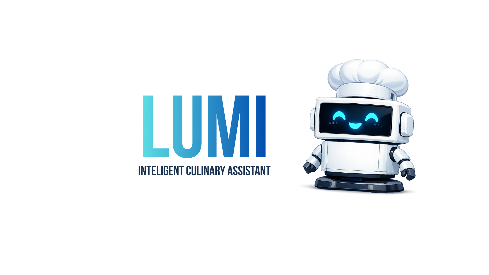

<!-- Banner -->

 

<!-- Intro -->

  <strong>Estudante de Sistemas de Informação — IFES (Campus Colatina)</strong> 
  Desenvolvedor em formação • Foco em Engenharia de Software, Dados e IA  
  Sempre aprendendo, explorando e construindo projetos práticos  
   
  

---

## 🧠 Sobre mim

- 🧩 Interesse principal em **Engenharia de Dados, Sistemas Escaláveis e IA aplicada**.  
- ⚙️ Experiência prática com **Python, APIs REST, JSON e POO**.  
- 🚀 Amo arquitetura, análise e resolução de problemas complexos.  
- 🌎 Inglês Avançado (vivência — Everett High School, EUA).

---

## 🧰 Tecnologias & Ferramentas

  
  
  
  

---

## 🚀 Estudando Atualmente

  
  
  
  
  
    
  

---

<!-- PROJETOS EM DESTAQUE - GITHUB PREMIUM STYLE -->

  <h2 style="text-align: center; font-size: 2rem; margin-bottom: 25px;"; align="center">
    📚 Projetos em Destaque
  </h2>

<table style="width:100%; border-collapse: collapse;"; align="center">
<tr>
  <th style="padding: 12px; border-bottom: 2px solid #8a2be2;">Projeto</th>
  <th style="padding: 12px; border-bottom: 2px solid #8a2be2;">Descrição</th>
  <th style="padding: 12px; border-bottom: 2px solid #8a2be2;">Tecnologias</th>
  <th style="padding: 12px; border-bottom: 2px solid #8a2be2;">Link</th>
</tr>

<!-- Projeto 1 -->
<tr>
  <td style="padding: 12px; text-align: center;">
     
  </td>

  <td style="padding: 12px;">
    RPG de terminal com IA e arquitetura modular.
  </td>

  <td style="padding: 12px;">
    Python OpenAI API POO
  </td>

  <td style="padding: 12px; text-align: center;">
    <a href="https://github.com/TheTekig/EUCHORNIA" target="_blank"
      style="padding: 8px 12px; background: #8a2be2; color: white; border-radius: 6px; text-decoration: none;">
      Ver projeto
    </a>
  </td>
</tr>

<!-- Projeto 2 -->
<tr>
  <td style="padding: 12px; text-align: center;">
     
  </td>

  <td style="padding: 12px;">
    Geração e exportação automática de currículos em PDF.
  </td>

  <td style="padding: 12px;">
    Python JSON
  </td>

  <td style="padding: 12px; text-align: center;">
    <a href="https://github.com/TheTekig/GeradorCurriculos" target="_blank"
      style="padding: 8px 12px; background: #8a2be2; color: white; border-radius: 6px; text-decoration: none;">
      Ver projeto
    </a>
  </td>
</tr>

<!-- Projeto 3 -->
<tr>
  <td style="padding: 12px; text-align: center;">
     
  </td>

  <td style="padding: 12px;">
    Criação de testes automatizados via LLM + Pytest.
  </td>

  <td style="padding: 12px;">
    Python OpenAI API
  </td>

  <td style="padding: 12px; text-align: center;">
    <a href="https://github.com/TheTekig/Gerador-de-Testes-com-IA" target="_blank"
      style="padding: 8px 12px; background: #8a2be2; color: white; border-radius: 6px; text-decoration: none;">
      Ver projeto
    </a>
  </td>
</tr>

<!-- Projeto 4 -->
<tr>
  <td style="padding: 12px; text-align: center;">
     
  </td>

  <td style="padding: 12px;">
    Assistente de Cozinha!
  </td>

  <td style="padding: 12px;">
    Python OpenAI API FastApi
  </td>

  <td style="padding: 12px; text-align: center;">
    <a href="https://github.com/TheTekig/Project-Lumi" target="_blank"
      style="padding: 8px 12px; background: #8a2be2; color: white; border-radius: 6px; text-decoration: none;">
      Ver projeto
    </a>
  </td>
</tr>

</table>

---

## 📈 Estatísticas de Código

---

## 📫 Contato

  

